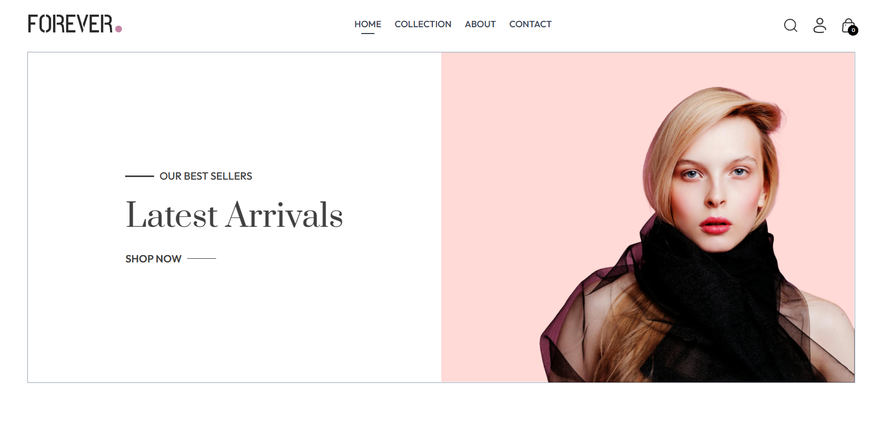
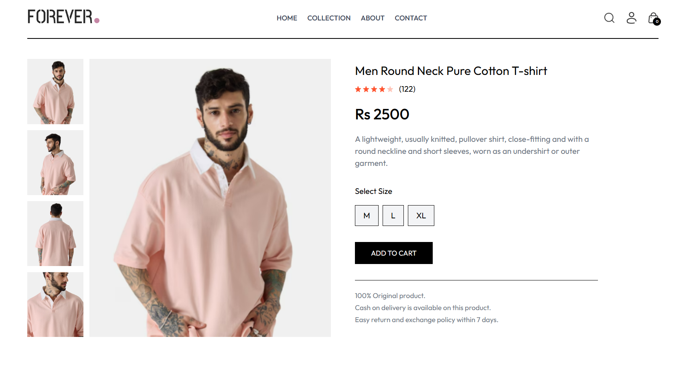
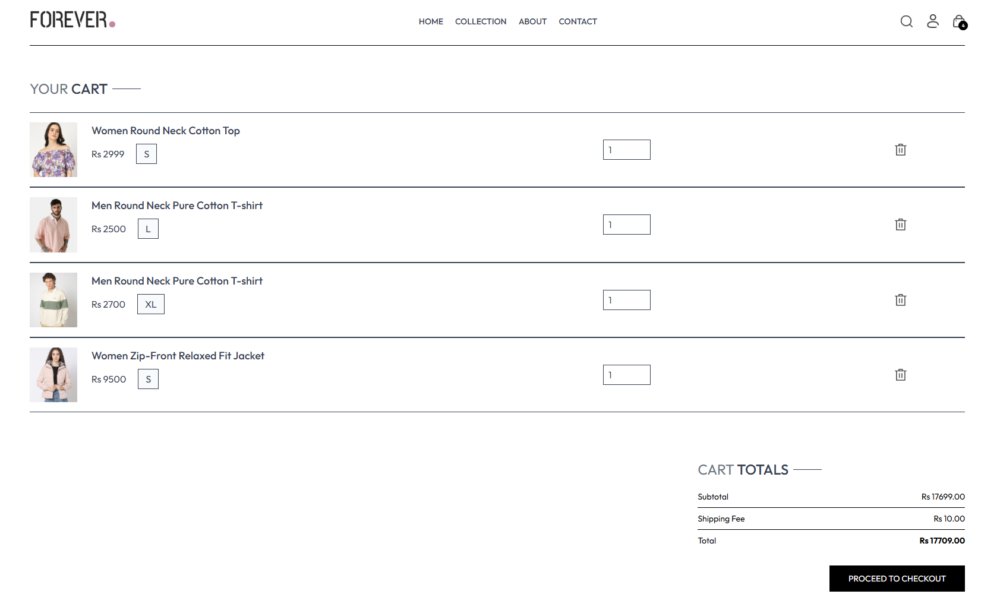
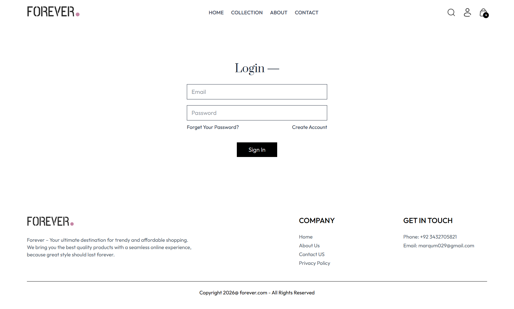
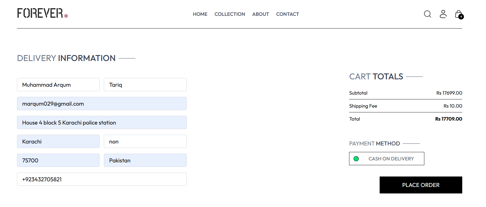
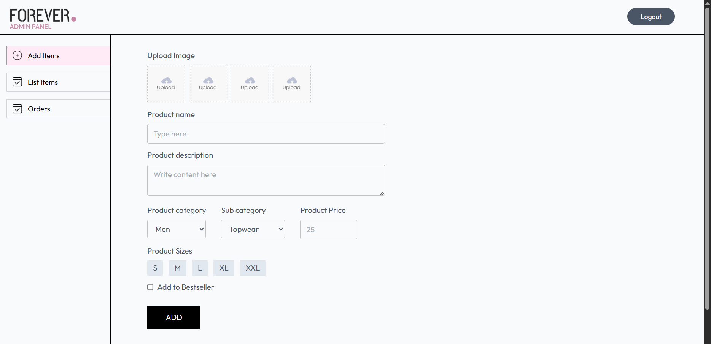
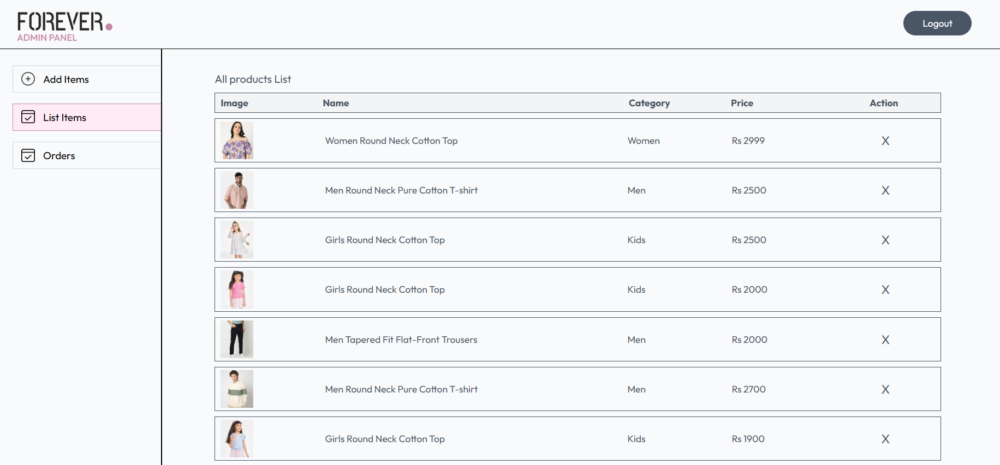
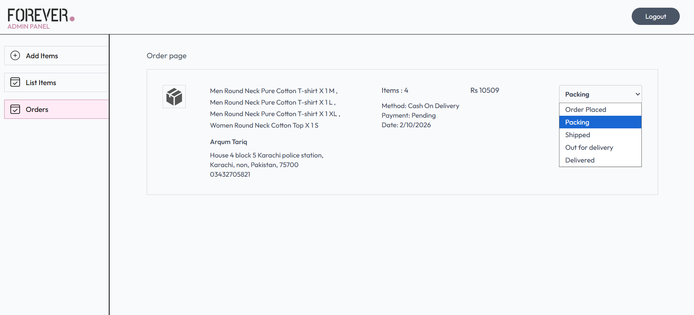

<!--
  SEO KEYWORDS: Innoze, Innoze Tech, Innoze Tech Solutions, InnozeTech,
  innoze github, innoze tech github, innoze tech solutions github, 
  MERN Stack E-commerce, React Shopping Cart, Node.js E-commerce, Online Clothing Store,
  Full Stack Web Application, MongoDB E-commerce, React Tailwind E-commerce, JavaScript Shopping Website,
  Responsive E-commerce, Admin Dashboard, Product Management, Innoze, Innoze Tech, Pakistan Software House,
  E-commerce Development Pakistan, Custom E-commerce Solution, MERN Developer Pakistan
-->

<h1>🛍️ Forever — Full Stack E-Commerce Clothing Store</h1>

A production-ready, full-stack e-commerce clothing platform built by <strong><a href="https://github.com/innozetech">Innoze</a></strong> — featuring complete shopping experience, secure authentication, and a powerful admin dashboard.

---

## 🎯 The Problem

Clothing businesses in Pakistan and globally struggle with:

- ❌ No proper online presence to sell products
- ❌ Manual order management — time-consuming and error-prone
- ❌ No centralized system to manage products, inventory, and customers
- ❌ Poor mobile experience leading to lost sales
- ❌ No admin control over orders and product listings

---

## ✅ Our Solution

**Innoze** engineered a complete, scalable e-commerce platform that gives clothing businesses a full digital storefront — from product discovery to order delivery — all managed from a single powerful admin dashboard.

> A business owner can now manage their entire online store from one place — no technical knowledge required.

---

## 💼 Business Impact

| Before | After |
|:-------|:------|
| Manual order tracking via WhatsApp/calls | ✅ Automated order management system |
| No online product catalog | ✅ Full product listing with filters & search |
| Zero digital presence | ✅ Professional e-commerce storefront |
| No customer data or insights | ✅ Centralized customer & order database |
| Lost sales due to poor mobile experience | ✅ Fully responsive across all devices |

---

## ✨ Key Features

### 🛍️ Customer Experience
- 🔐 Secure user registration & login
- 🛒 Shopping cart with real-time updates
- 🔍 Smart search & product filtering (category, type, price)
- 📦 Easy order placement & order history tracking
- 💵 Cash on Delivery support
- 📱 Fully responsive — mobile, tablet & desktop
- 🔔 Real-time notifications & feedback

### 👨‍💼 Admin Control Panel
- 📊 Complete admin dashboard
- ➕ Add & manage products with image uploads
- 📋 Full product list management
- 📦 Order tracking & status updates
- 🖼️ Cloud-based image storage via Cloudinary

---

## 🛠️ Tech Stack

| Layer | Technology |
|:------|:-----------|
| **Frontend** | React.js, Vite, Tailwind CSS |
| **Backend** | Node.js, Express.js |
| **Database** | MongoDB, Mongoose |
| **Auth** | JWT (JSON Web Tokens) |
| **Media Storage** | Cloudinary |
| **Deployment** | Vercel |

---

## 📸 Project Screenshots

### 🏠 Homepage

### 🛍️ Product Collection

### 📄 Product Details

### 🛒 Shopping Cart

### 👤 User Login

### 📦 Place Order

### 📊 Admin — Add Product

### 📋 Admin — Product List

### 📦 Admin — Orders Management

---

## 🌟 Why Innoze Built This

At **Innoze**, we don't just write code — we engineer business solutions. Every feature in this platform was designed with one goal: **to help businesses sell more, manage less, and grow faster.**

This project is a testament to our ability to deliver **production-ready, scalable, and client-focused digital products** from scratch.

---

## 🤝 Want a Similar Solution for Your Business?

> Whether you need an e-commerce store, a booking platform, or a custom web application —
>
> **Innoze is here to build it, design it, and grow it with you.**

 

&nbsp;

---

  Built with ❤️ by <strong><a href="https://github.com/innozetech">Innoze</a></strong> — Karachi, Pakistan 🇵🇰

